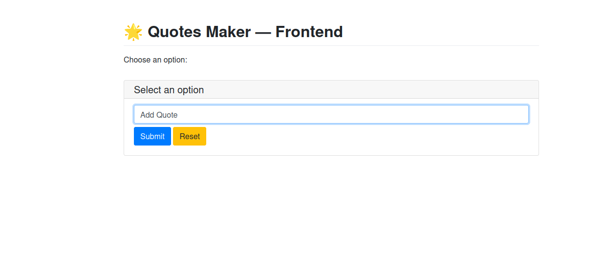
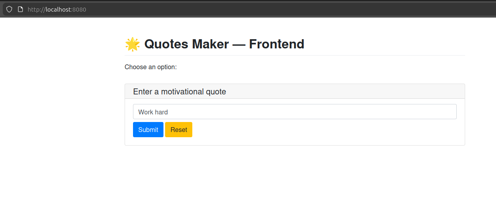
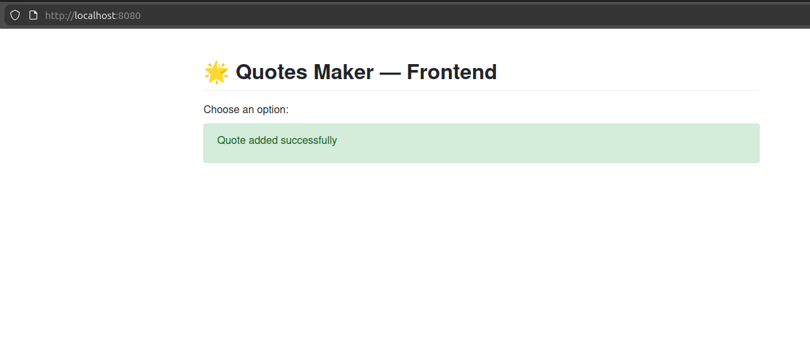
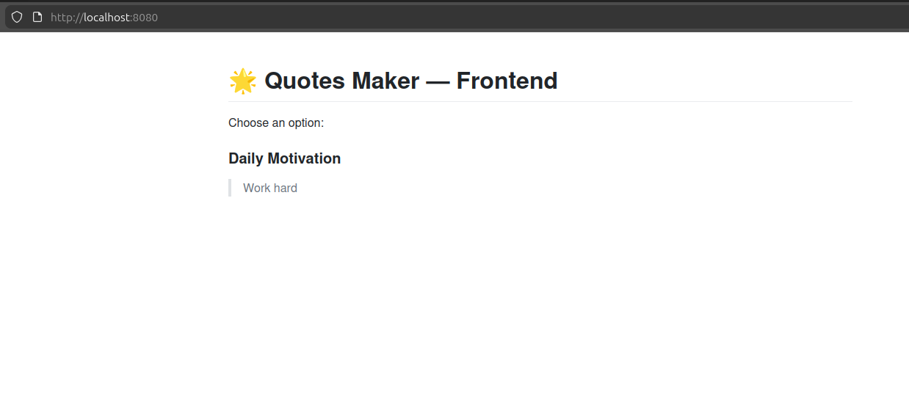
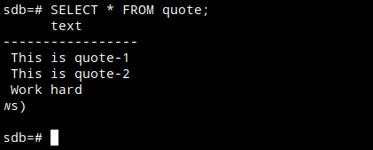

# 📄 Project Description

Quotes maker is a containerized microservice application designed to help users store and view motivational quotes. 

The project is built to practice real-world Kubernetes, Helm, microservices, and CI/CD branching strategies.

The system consists of a frontend, a backend API, and a database, all deployed as separate containers managed entirely on Kubernetes using Helm charts.

This project is intentionally simple but architected like a real cloud-native system, making it perfect for hands-on learning.


## Application Components: Version-1


| Component | Technology | Description | Notes |
|-----------|-----------|-------------|-------|
| Frontend | Python PyWebIO | Runs as a standalone container. Provides two features: Add Quote form, View Daily Quote (fetched from backend). | Communicates with backend over HTTP  |
| Backend API | Python Flask | Exposes REST API: GET /quotes → returns random/daily quote, POST /quotes → adds a new quote. Connects to PostgreSQL container using environment variables. | Will have more endpoints in future features |
| Database | PostgreSQL | Runs as a Kubernetes StatefulSet. Stores quotes in a single table. | Uses PersistentVolumeClaim for data durability |


Note: This is the plan for version 1 of the application. We will add more components as we progress.

## Sample screenshots


### Home Page



### Add a new quote





### View the Quotes




### Content of quotes database




## Activity History

10/12/2025: 

```
1. We created the basic frontend UI. Currently the Backend API and Databse are not developed, so the functionality breaks, but the app can be run.
2. Also created a feature branch for continue working on front end.
3. Branch name: frontend-feature
```

12/12/2025: 

```
1. Created a backend API that input the quote and retreive it from a list, and created a new branch called: frontend-feature
2. After the basic testing, we removed the list and integrated it with postgres database
3. Postgres deployed as a docker container
4. Tested the integration, and first version of application is ready
5. Sample screenshot added for reference
6. Finally merged it to main branch
```


13/12/2015: Completed

```
1. Create containers for frontend and backend
2. Push to Dockerhub
3. Deploy it in docker environment and verify the working
```

Next Step:
```
Create a staging branch, and merge all changes.
Test the application in this branch.
Integrate github Actions to automate build and push image to DockerHub - Continuous Integration
```